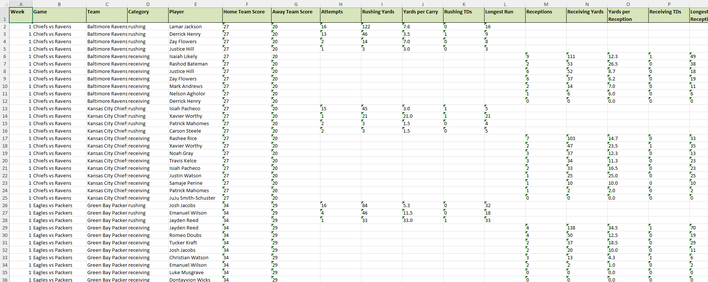
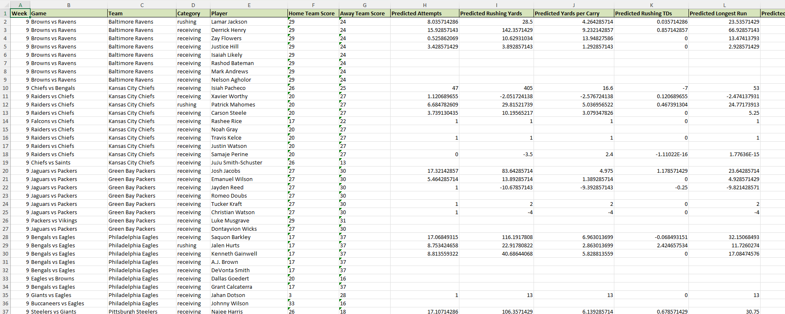
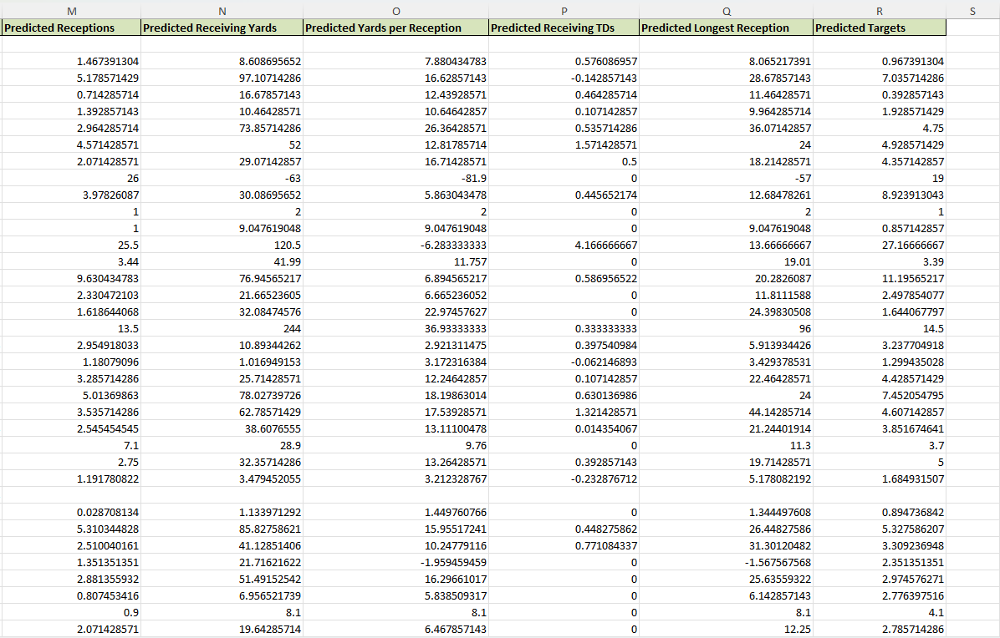

# NFL Machine Learning Stats Predictor

The **NFL Stats Predictor** application is designed to fetch weekly NFL offensive player stats and make predictions for the next week using machine learning. This application utilizes `customtkinter` for a modern interface, displaying weekly player stats and predictions in Excel format.

> **Note**: Please allow 20-30 seconds for the stats download and prediction generation process to complete.

---

## Features

- Download NFL offensive stats for specified weeks and year.
- Predict next week's stats based on historical data.
- Save player stats and predictions to Excel with organized, formatted sheets.

## Libraries and Dependencies

The following libraries are required for this application:

- `customtkinter`: For enhanced UI components.
- `tkinter`: Built-in Python library for GUI applications.
- `requests`: For fetching data from the NFL API.
- `pandas`: For data manipulation and Excel generation.
- `datetime`: To retrieve and manage current dates.
- `threading`: To manage background tasks and avoid GUI freezing.
- `traceback`: For error handling and debugging.
- `scikit-learn`: for machine learning model building.
- `numpy`: For numerical operations.

### Installation

Ensure these libraries are installed. You can install them via pip:
```bash
pip install customtkinter requests pandas scikit-learn numpy
```

## Usage

1. **Specify Weeks**: Enter weeks in the format `1-8` or `1,3,5-7` to define the range or specific weeks.
2. **Specify Year**: Input the NFL season year.
3. **Download Stats**: Click the "Download Offensive NFL Stats + Prediction Excel" button to download and generate predictions.

The data will be saved as an Excel file with player stats for the selected weeks and a separate sheet with next week's predictions.

## Screenshots

### Example 1: Stats Excel Sheet 
 

### Example 2: Predictions Excel Sheet
 


